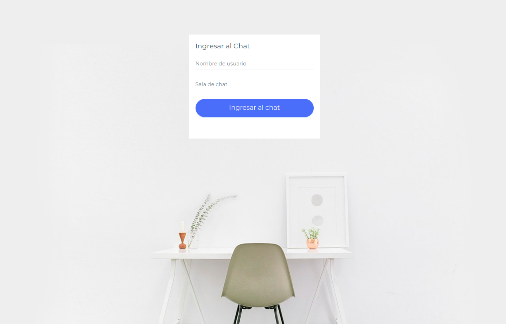
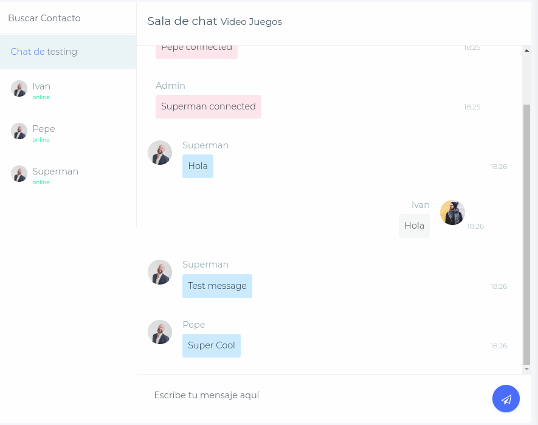

# Chat

This is a chat with sockets (Sockets.io). You can chat with users in chat rooms.

This project includes Docker files to run in containers.

### Login

You can enter the chat with a username. You need to select a chat room.



### Chat

On the left, you have all the users connected.

You can receive and send a message to all users.



## Remember

You need to install all dependencies with the following command.

```
npm install
```

# Docker Notes

- exec a shell on this docker: docker exec -it chat-system_app_node sh --color=auto

- Install new dependencies from inside the container.

- Build the project from inside the container.

- If you erase the dist folder, you need to rebuild it.

- If you erase the node_modules folder, this deletes the reference on the container. You need reinstall dependencies with ```npm install`` inside of the container.